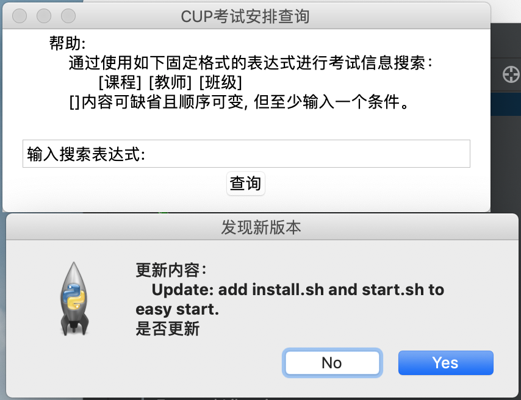
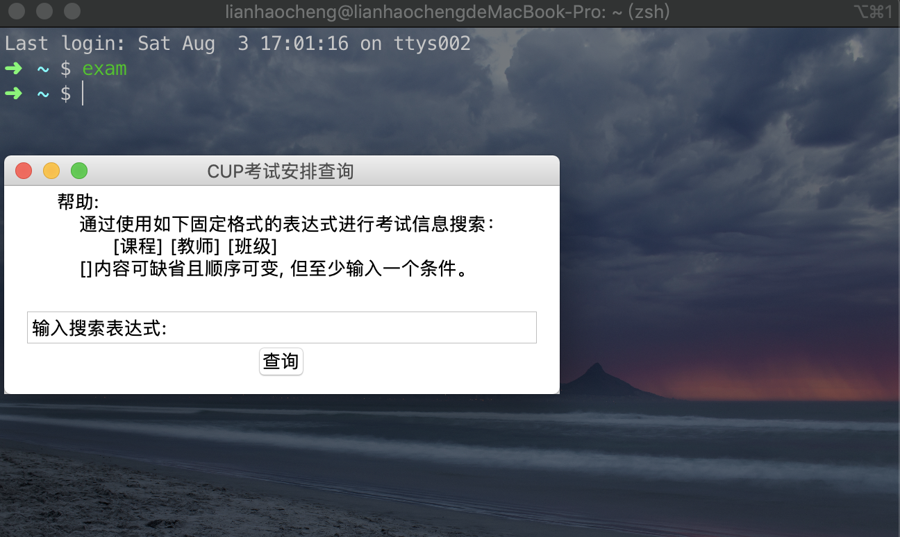
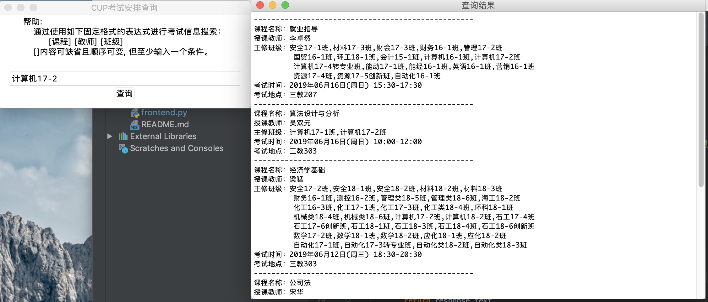
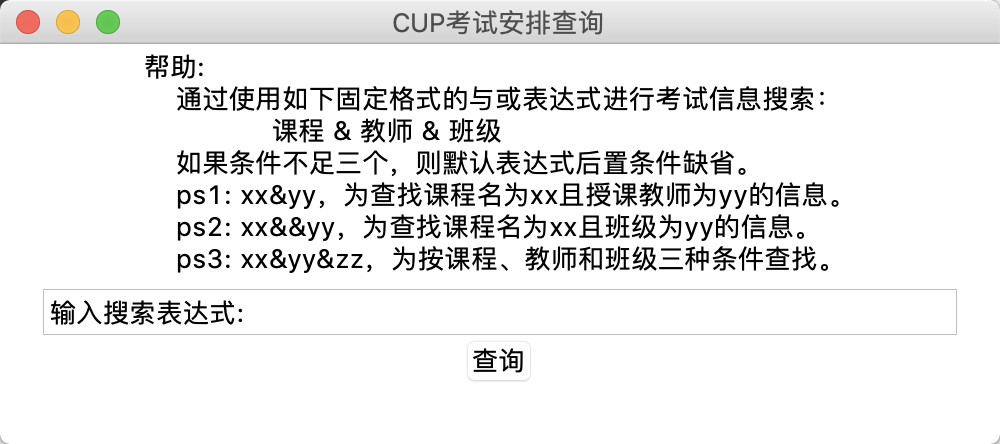
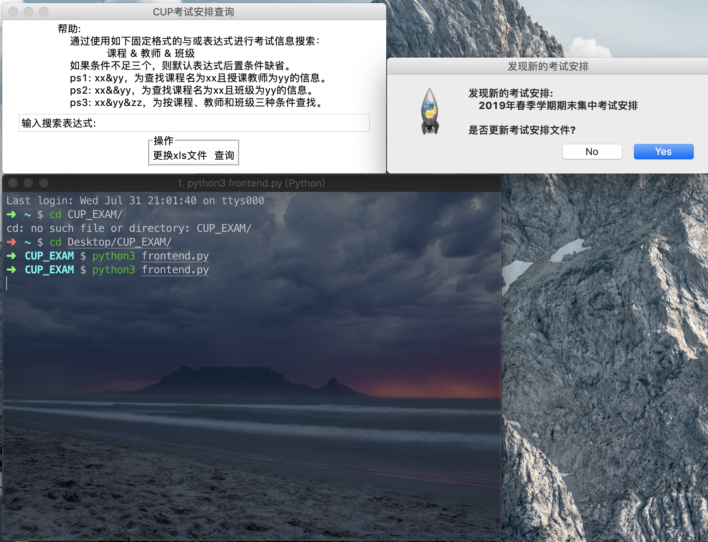
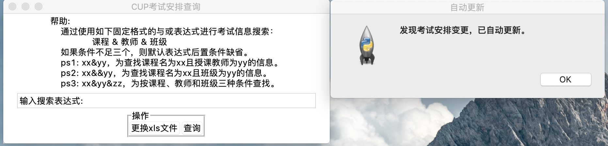
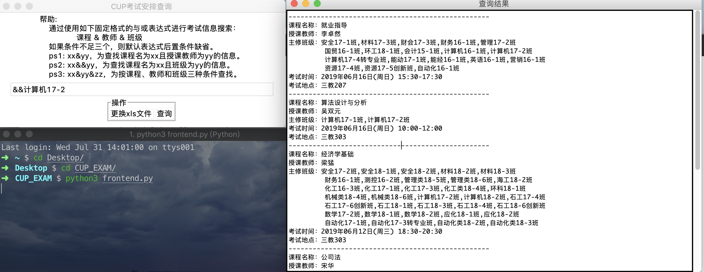
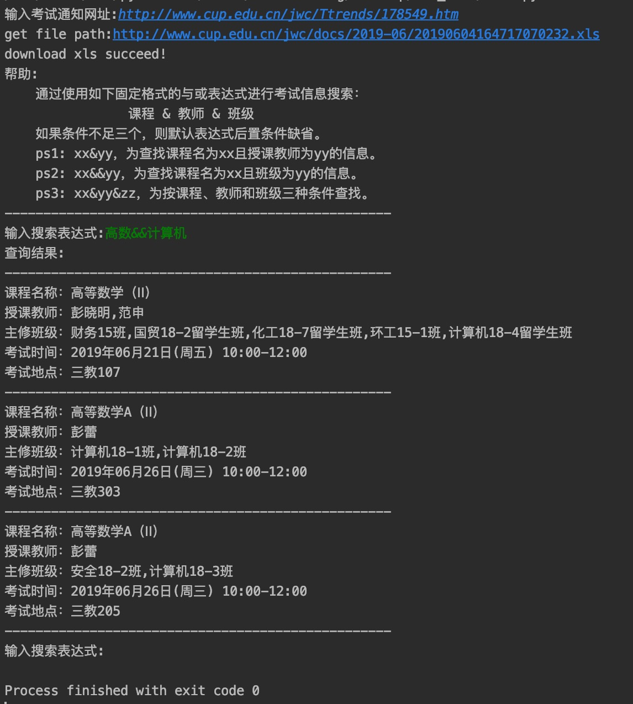

# 中国石油大学（北京）考试安排查询脚本  

## 环境依赖:
```shell
pip3 install requests
pip3 install xlrd
```

## 用法:
```shell
python3 frontend.py
```

- ### 为脚本添加命令

  ```shell
  python3 setup.py [--clean (which means remove additional shell)]
  ```

  如果添加命令成功，你可以运行下面的命令：

  After that, you can run:

  ```
  exam
  ```

  来使用脚本。

- ### 可能的安装问题
  Windows系统可能没有命令”setx“，所以你需要手动设置环境变量。

  ```
  系统环境变量->PATH->新建->名称:exam, 值: (文件夹位置)\exam.bat
  ```


## 运行结果:  

### New version 2.4.1

- 更新：上线自动版本更新功能。

  

- 问题:

  Windows系统可能没有“unzip"命令，程序将帮你下载安装程序，位置在运行程序的目录下。你需要手动安装它，并设置环境变量。

  在命令行内输入‘unzip'后，如果不提示无命令代表安装成功。安装成功后，重新运行’exam‘命令启动脚本，自动进行版本更新。

  通过命令行设置：
  
  ```shell
setx /m PATH %PATH%;C:\Program Files (x86)\GnuWin32\bin
  ```

  如果没有setx命令，则手动设置：
  
  ```shell
  系统环境变量->PATH->编辑->尾部添加：“C:\Program Files (x86)\GnuWin32\bin;”
  ```

### Old version 2.3

- Update: add install.sh and start.sh to easy start.

  

### Old version 2.2
- Update: Simplify search expressions and remove the dependency on the fuzzywuzzy library.   
   

### Old version 2.1
- Update: The program automatically maintains test scheduling files.  
    

### Old version 2.0  
- new feature  
    
    


- simple example  
    

### Old version 1.0  
  

- By the way, if the **content.xls** is existed, the program will not ask for a url. 

- And if you want to update it, you can delete it and input new url. 